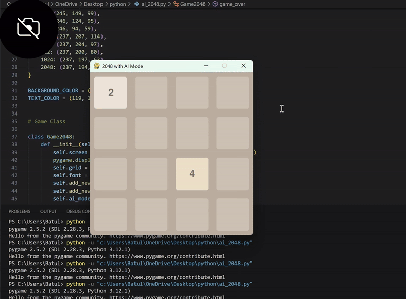

# 2048 with AI (Pygame + NumPy)

A clone of the classic **2048 puzzle game**, built with **Pygame** for graphics and **NumPy** for grid operations.  
You can play manually using the arrow keys, or toggle an **AI mode** that plays automatically using a heuristic evaluation strategy.

---

## 📸 Demo
<p align="center">
  
</p>


---

## ✨ Features

- Classic 2048 gameplay with smooth animations.
- Manual play using arrow keys.
- Game over detection: The game ends when no moves are possible.
- 4x4 grid layout with visually distinct tiles.
- Randomized tile generation (2 or 4) for replayability.
- Smooth keyboard input for responsive gameplay.
- Optional AI mode that can play automatically.
- Assigns heuristics/scores to decide the best move.

---

## 🤖 AI Details
The AI chooses moves by simulating each possible direction and evaluating the resulting grid.  
Its scoring function considers:
- **Empty Cells** → prefers boards with more available moves.  
- **Max Tile in Corner** → rewards keeping the largest tile in a corner.  
- **Smoothness** → penalizes large differences between neighboring tiles.  

This helps the AI survive longer and reach higher tiles.

---

## 🛠 Tech Stack
- **Python 3**
- [Pygame](https://www.pygame.org/) → Game window, graphics, and input handling
- [NumPy](https://numpy.org/) → Grid and array operations
- Standard Python libraries (`random`, `time`, `sys`, `math`)
  
  ---

## 🎮 Controls / Usage
- Arrow Keys → Move tiles (Up, Down, Left, Right)
- A → Toggle AI Mode on/off
- Close Window → Exit game

---

## 🔮 Future Improvements
- Add undo / redo functionality.
- Include score tracking and leaderboard.
- Implement different AI strategies (Minimax, Expectimax).
- Add sound effects and animations.
- Display game over and save the final board.
- Make a web version playable in a browser.

---

## 🚀 Installation
1. Clone the repository:
   ```bash
   git clone https://github.com/batulhs/AI-2048-Game.git
   cd AI-2048-Game
2. Install dependencies:
   ```bash
   pip install -r requirements.txt

---

## 🤝 Contributions
This project was independently developed in its entirety by Batul H Suratwala, including the game mechanics, AI logic, feature implementation, and documentation.
